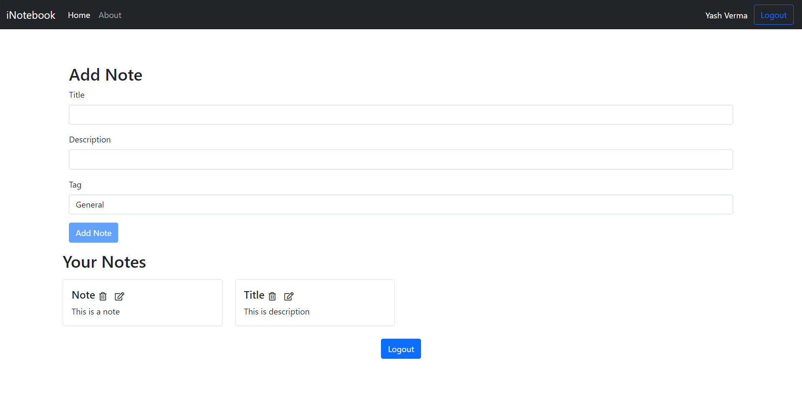
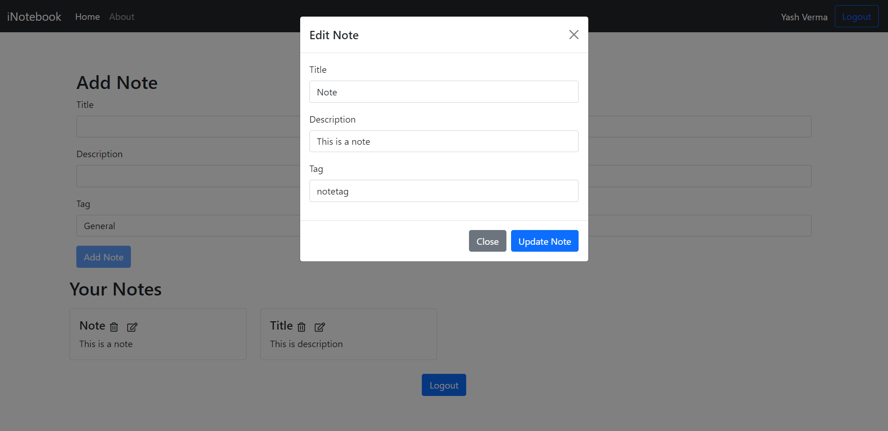

# i-Notebook | Your notes are safe on the cloud

i-Notebook is a notes making web appliation, built using MERN stack, which can be used by users to save their notes and access, edit or delete those from anywhere at anytime.

## Table Of Contents

- [Overview](#overview)
  - [The Project](#the-project)
  - [Screenshot](#screenshot)
  - [Link](#link)
- [Development](#development)
  - [Tech Stack](#tech-stack)
  - [What i learned](#what-i-learned)
  - [Useful Resources](#useful-resources)
- [Author](#author)

## Overview

### The Project

i-Notebook is a web applicaction built using MERN, where a user has to create a account to make and save notes on this application. A user has access only to his notes. User authentication is managed by JWT Authentication. All the user data and notes data are saved on MongoDB Atlas. 

Front End of the project is built using ReactJS. All the components used are funtional based components. In this project useState and useContext hooks are used. The Front End design of the project is fully-responsive.

Back End of the project is built using Node.JS with Express.JS framework. This API has two routes `/auth` and `/notes`.

### Screenshot

### Link

[Live Site URL](https://project-inotebook.web.app/)

## Development

### Tech Stack

- HTML5 markup
- CSS custom properties
- Bootstrap
- Javascript
- MongoDB Atlas
- Express Framework
- ReactJS Library
- Node.JS
- JWT Authentication
- Mongoose

### What i learned

I learned a lot of things working on this project. When i started this project i was learning ReactJS and this project helped me to get better at ReactJS.
I learned using JWT package for user authentication, which was a big plus for me.
I also learned to use mongoose and MongoDB atlas.

### Useful Resources

There were times when i got stuck on some things while working on this project, for which i took help from a few websites which was very much helpful for me. The websites that helped me the most are:
- [StackOverflow](https://stackoverflow.com) for debugging and
- [YouTube](https://youtube.com) for learning new things.

## Author

- GitHub - [@yash1699](https://github.com/yash1699)
- LinkedIn - [@yash-verma-5a84641a9](https://linkedin.com/in/yash-verma-5a84641a9)